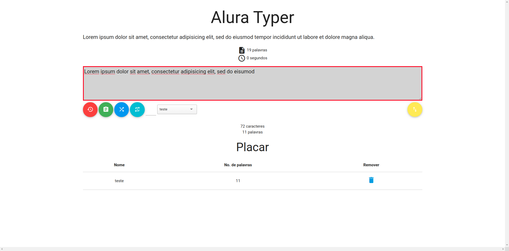

# Projeto Alura Typer

Projeto desenvolvido ao final do curso JavaScript para Web da Alura Cursos Online, com o intuito de aprimoração e fixação do que foi aprendido.

Tecnologias utilizadas:

- HTML5
- CSS3
- JavaScript
- NodeJS

Antes de iniciar o jogo, é possível adicionar o seu nome como jogador, visualizar o placar e trocar frases. Após iniciar, cada frase terá o seu tempo de digitação. 

Para tornar a jogabilidade melhor, todo carácter será comparado ao da frase selecionada. A borda fica verde quando está certo e vermelha quando algo está errado.

Após o término do tempo, o jogador tem o seu nome junto com a sua pontuação inseridos no placar.
